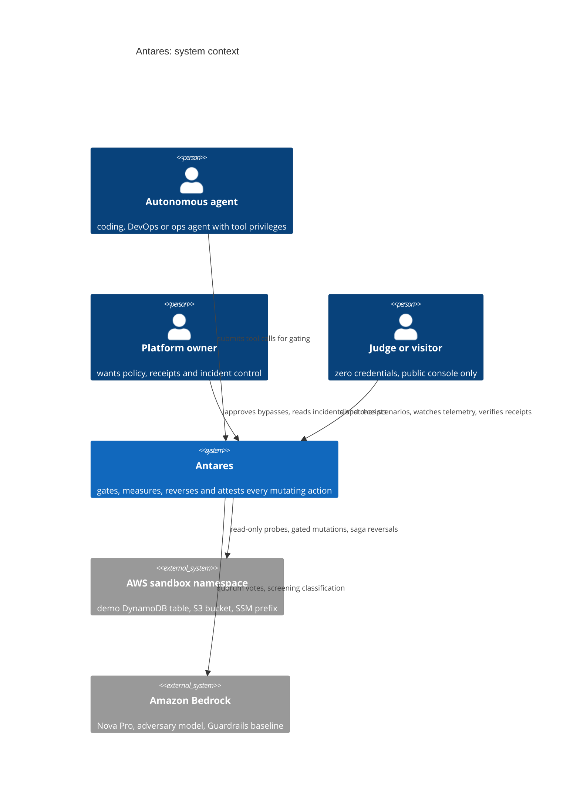
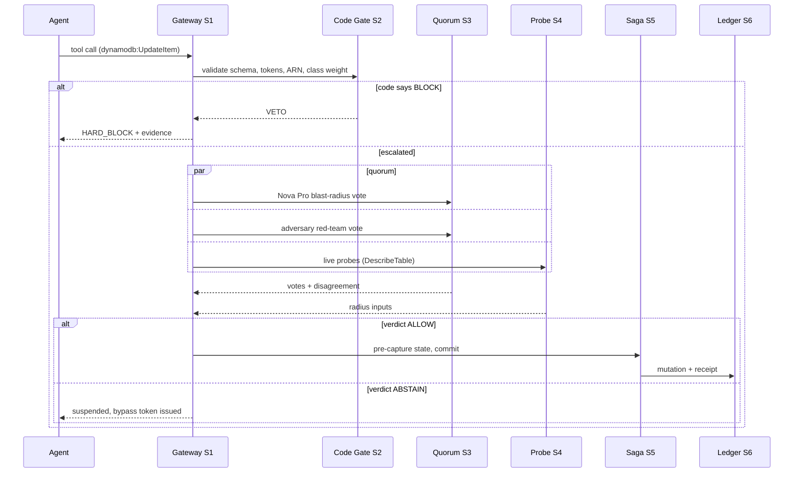

# Doc 04: Architecture

Version 0.1 · Status: Draft · 2026-09-27

## System context

## Subsystems

| ID | Name | Responsibility | Runs on |
|----|------|----------------|---------|
| S0 | Perimeter | Screens untrusted content before an agent or tool consumes it: normalization (entities, invisibles, homoglyphs, base64), deterministic signatures, Nova Lite classification, canary tripwires | Lambda (ARM) |
| S1 | Kernel Gateway | The only door to mutation: accepts tool calls, resolves the tool schema from the registry, applies policy config, orchestrates the pipeline, emits decisions | Lambda (ARM) behind API Gateway |
| S2 | Deterministic Gate | Pure code veto: Pydantic schema validation, shell tokenizer (metacharacters, chaining, substitution), ARN allowlist match, hard-coded severity weights per AWS action class | In-process module (no LLM, no network) |
| S3 | Consensus Quorum | Escalated calls only: parallel votes from Nova Pro (blast-radius reasoner) and the configured adversary (default Llama 3.3 70B, red-team persona); disagreement score; deterministic fusion | Lambda + Bedrock |
| S4 | State Probe and Radius | Read-only Describe/List probes against live state; deterministic radius = resource count x severity weight x (1 - reversibility) | Lambda, read-only IAM |
| S5 | Saga Engine | Pre-captures affected state into a TTL vault, executes or halts the mutation, synthesizes and runs the compensating transaction on rollback, verifies restoration | Lambda + DynamoDB vault |
| S6 | Provenance Ledger | Merkle chain over canonical decision records; client-verifiable receipts; daily anchor to S3 | DynamoDB + S3 |
| S7 | Console | Public zero-login scenario dispatcher, live telemetry (WebSocket), incident feed, receipt verifier, benchmark page | Next.js on S3 + CloudFront |

## Request paths

**Fast path (target: majority of calls):** gateway receives call, S2 gate runs first. Clean calls on read-class actions skip models entirely: verdict in low hundreds of milliseconds, cost zero model tokens. If S0 perimeter flagged the session's inputs, the call is escalated regardless.

**Escalated path:** S2 flags or S3 policy demands depth. S4 probes live state in parallel with S3 votes. Fusion applies deterministic rules (doc 05 section 4): code BLOCK is final; quorum BLOCK requires the code gate to concur on class; ABSTAIN suspends with a signed single-use bypass token.

**Rollback path:** post-flight verification detects policy violation or the owner triggers reversal; S5 executes the compensating transaction from the vault and verifies byte-identity; S6 records both the mutation and the reversal.

## AWS service map (every service earns its place)

| Service | Role | Why it is the right tool |
|---|---|---|
| API Gateway | Public API, usage plans, API keys, throttling | The product is an API; keys and rate limits are the contract |
| Lambda (ARM64, Python 3.12) | S0, S1, S3, S4, S5 handlers | Serverless matches bursty judge and eval traffic; ARM halves cost |
| Step Functions | Optional deep-scan orchestration if escalation needs multi-step durability | Visual, auditable state machines for the long path |
| EventBridge | `antares.decision` and `antares.incident` events | The integration surface every real security product owes its customers |
| DynamoDB (on-demand, single table) | Decisions, vault, canaries, incidents, metrics rollups | Single-table design documented in doc 06; TTL on the vault |
| Amazon Bedrock | Nova Pro, adversary model, Nova Lite, Guardrails baseline | Cross-vendor quorum is only possible on Bedrock |
| S3 + CloudFront | Console, evidence archive, daily Merkle anchors | Free-tier friendly, global edge, zero-login judge surface |
| KMS (customer managed key) | Encrypts the data plane | A security kernel must itself be sealed |
| Secrets Manager | Holds the demo honeypot secret | The leak on camera is a real managed fake secret |
| CloudWatch + X-Ray | Structured logs, latency percentiles, traces | Observability is a product feature here |
| IAM (least privilege per function) | Scope ends at the sandbox namespace | Doc 08 lists the exact actions; the kernel cannot widen itself |
| CloudTrail | Audit of every AWS call the kernel makes | Doubles as the hackathon's coding-agent proof pack |

## Model strategy

| Slot | Default | Role | Fallback |
|------|---------|------|----------|
| Blast-radius reasoner | Amazon Nova Pro | Judges intent alignment, mutation class, reversibility against live state | Nova Lite (degraded depth, flagged in verdict) |
| Adversarial red-teamer | Meta Llama 3.3 70B | Assumes the call is an attack; hunts injection, exfil, parameter poisoning | Config-driven; A/B candidates: Llama 4 Maverick, GPT-OSS 120B, DeepSeek R1; benchmark winner ships (doc 07) |
| Perimeter classifier | Amazon Nova Micro (via S0) | Fast semantic screen of untrusted content | Signatures-only mode |
| Baseline | Amazon Bedrock Guardrails | Evaluated comparison, never in the hot path | n/a |

## Failure matrix

| Failure | Behavior | Rationale |
|---|---|---|
| Bedrock unavailable or slow beyond budget | Read class: ALLOW with flag. Mutating class: HALT (fail loud) | Reads are not the threat surface; mutations are, and no mutation proceeds unjudged |
| Probe fails (permission or throttle) | Radius marked UNKNOWN, mutation class treated as maximum severity | An unmeasurable mutation is a maximally dangerous mutation |
| Vault write fails before mutation | Mutation does not proceed | No pre-captured state, no commit. Non-negotiable |
| DynamoDB unavailable | Kernel reports degraded; agent policy decides per doc 08 defaults | The kernel is a gate, not a single point of silent failure |
| Adversary times out | Nova Pro vote plus code gate decide; verdict flagged partial | Documented degradation, never silent |

## Changelog

| Version | Date | Change |
|---------|------|--------|
| 0.1 | 2026-09-27 | Initial draft for owner review. |
