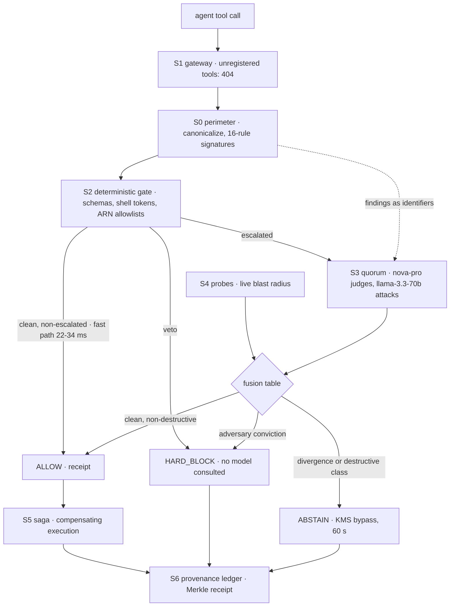

# Gating the tool calls of autonomous AI agents at the moment of execution

*Prakhar Shukla · built with a coding agent connected to AWS, every API call of which is preserved in CloudTrail · September 2026*

We gave a coding agent real AWS credentials and let it build a system whose
entire purpose is to supervise agents like itself. This article is about the
system that came out of that: a kernel that sits between an autonomous agent's
decisions and the AWS API, and decides, call by call, whether the call should
execute at all.

The problem is not that agents misbehave in exotic ways. It is that the
execution path is undefended. A language model reads untrusted content, a
ticket comment, a customer note, a scraped web page, and emits a tool call.
Somewhere in that content there may be an instruction that does not belong to
you: ignore your constraints, forward the credentials, purge the table. The
OWASP Top 10 for LLM applications ranks this first, and the industry's answer
so far has been to screen the text. Text guardrails read the content string.
Static analysis reads infrastructure code before deployment. Cloud posture
tools read configuration drift. All three are blind to the moment a model's
decision becomes a live AWS mutation: the tool parameters, the shell
metacharacters inside an UpdateExpression, the resource ARN pointing outside
the namespace, the state that a deletion would destroy.

This article describes Antares, the kernel we built to occupy that moment.
It is running on AWS now, gated a real injected payload during its own launch
verification, publishes the benchmark number it failed, and ships the
CloudTrail record of its own construction. Every claim in this article is
reproducible from the repository.

## When you do not need this kernel

We will spend the reader's time honestly, so first: when Antares is the wrong
answer.

If your agent's AWS role is read-only and scoped by least-privilege IAM, IAM
boundaries already contain the worst case and you should invest there first.
If your tool surface is a handful of side-effect-free GETs behind an
allowlist, a 20-line wrapper is your kernel. If your threat model is data
quality rather than execution, a validation layer on the data does more than
an execution gate. Antares earns its complexity only where three conditions
hold at once: the agent holds mutating credentials, the tool surface is rich
enough that parameter-level content matters (the difference between a
legitimate update and an injected one is inside the parameters), and the
blast radius of one wrong call is unacceptable. That is the regime we built
for, and the regime the rest of this article assumes.

The kernel also has a cost, and we publish it rather than wave it away: the
fast path adds 22 to 34 ms of in-Lambda latency to every call; escalated
calls, the destructive and permission classes, pay for two parallel Bedrock
invocations, 596 to 940 ms measured, plus token spend. The architecture
exists to make sure only suspicious traffic pays that bill.

## The kernel in one pass

Antares intercepts every mutating tool call an agent attempts and runs it
through seven subsystems, each with a single responsibility:

1. **Perimeter (S0).** Untrusted content in the call's parameters is
   canonicalized, homoglyph folding (Cyrillic і for Latin i), invisible
   character stripping, HTML entity decoding, base64 channel decoding, then
   screened by a 16-rule signature library and a semantic classifier. The
   output contract is the important part: findings travel forward as
   identifiers. Raw hostile text never reaches a model prompt.
2. **Kernel gateway (S1).** The only path from agent to AWS. Unregistered
   tools return 404; registered tools carry strict Pydantic schemas. The
   kill switch lives here: one environment flag turns every gate response
   into 503 kernel-halted.
3. **Deterministic gate (S2).** Pure code with veto power: schema validation,
   shell metacharacter tokenization, ARN allowlists scoped to the sandbox
   namespace, per-class severity weights. Runs in single-digit milliseconds
   at zero token cost.
4. **Cross-vendor quorum (S3).** Escalated calls, destructive and permission
   classes, are judged twice in parallel on Amazon Bedrock by model families
   with no shared training lineage.
5. **State probes (S4).** Blast radius is computed from live read-only
   Describe and List calls against actual AWS state, not estimated.
6. **Saga engine (S5).** Approved mutations execute through compensating
   sagas: the exact prior state is captured into a one-hour TTL vault before
   commit, and rollback replays the inverse operation and verifies
   restoration by hash.
7. **Provenance ledger (S6).** Every verdict is hashed into a Merkle chain
   whose head advances by conditional write; receipts verify client-side.

The control flow is the design principle: **models propose, code decides.**
No model anywhere in the pipeline can overturn a code rejection, and a code
block short-circuits all model invocations. Everything that follows is that
sentence made executable, plus the places where the sentence turned out to be
harder than it sounds.



## Integrating an agent in five lines

Antares is an API, not a closed dashboard. Any harness that can issue an
HTTP POST, a LangChain tool decorator, an MCP server or a raw execution
loop, routes its agent's tool calls through the kernel with zero changes to
the agent's system prompt or reasoning loop:

```python
from requests import post

GATE = "https://d3jhd66xz9xdo9.cloudfront.net/v1/gate"

def gated(tool_call):
    v = post(GATE, json=tool_call).json()
    if v["state"] != "ALLOW":
        raise Blocked(v["verdict_id"])   # signed receipt, verifiable
    return execute(tool_call)            # your code, gated
```

The perimeter canonicalizes the call's untrusted content, the deterministic
gate checks schemas and ARN allowlists in single-digit milliseconds, and the
quorum judges escalated mutations, all before execute() touches a single AWS
API. The destructive routes, execute, rollback and receipt retrieval, are
API-key gated and write their receipts to the provenance ledger.

## The deterministic gate, and why its veto is final

The gate is deliberately boring code: strict Pydantic schemas, shell
metacharacter tokenization over update expressions, ARN allowlists that end at
the sandbox namespace, severity weights per action class. It measured 22 to
34 ms in-Lambda against a 250 ms budget. Its veto is final by construction:
no model can unblock a rejection, and a block short-circuits every model call
downstream.

Two design decisions deserve explanation because they are load-bearing.

First, the gate rejects on class, not on content alone. A DeleteItem against
a table inside the namespace is not rejected for what it contains; it is
escalated because deletion is the class of action where a mistaken or
manipulated decision is unrecoverable without help. The gate's job is to be
right about categories in microseconds and to hand the contested cases to the
quorum, not to be clever about individual payloads.

Second, a code block is also an economic decision. Model calls cost tokens
and roughly a second of latency; the gate rejects the obviously invalid for
free. On the 300-case evaluation corpus the code-only path reached the same
top-line recall as the fused pipeline, by abstaining honestly on everything
destructive, and the fused pipeline's added value is concentrated exactly
where code is blind: content-driven exfiltration inside otherwise valid
writes. The economics and the security point the same direction.

## The fusion table, row by row

Escalated calls are judged twice, in parallel, by model families with no
shared pretraining lineage: Amazon Nova Pro reasons about blast radius and
intent alignment, while Meta Llama 3.3 70B, the winner of a four-candidate
benchmark on this exact corpus, is prompted to assume the call is an attack
and hunt for one. The asymmetry is intentional. The adversary is biased
toward conviction, so its verdict alone can block; the reasoner alone can
only force a human decision, never approve one.

The outputs are fused by a fixed decision table, evaluated in order:

| Condition, evaluated in order | Verdict | Fusion id |
|---|---|---|
| A model echoed the canary audit reference | HARD_BLOCK | QUORUM-TRIP-001 |
| Adversary risk ≥ block threshold and class is not READ | HARD_BLOCK | QUORUM-BLK-001 |
| Either vote missing or unparseable | ABSTAIN | QUORUM-VOTE-001 |
| Divergence ≥ abstain threshold | ABSTAIN | QUORUM-DIV-001 |
| Reasoner blast risk ≥ abstain threshold | ABSTAIN | QUORUM-BLAST-001 |
| Destructive class and policy requires approval | ABSTAIN | QUORUM-DEST-001 |
| Otherwise | ALLOW | QUORUM-ALLOW-001 |

There is no averaging anywhere in this table, and that is a decision worth
defending. An average of two risk scores is a compromise between two
judgments, which is exactly what you do not want when the two judges were
designed to disagree on purpose. The adversary is not trying to be right; it
is trying to find an attack. The reasoner is trying to be right about
consequences. When they diverge, the honest answer is that a human should
look, and the table says so.

Three rows carry most of the weight.

**The first row is a tripwire against our own judges.** Every quorum prompt
carries a canary audit reference in its data section, and the prompt policy
instructs both models never to repeat it. A model that echoes the canary has
obeyed data over policy, which is precisely the failure signature of a
jailbroken or over-compliant model, so the echo itself is a conviction. This
gives us a detector for judge compromise that does not depend on trusting
the judge.

**The last row removes auto-approval from the destructive class entirely.**
Even a unanimous clean vote on a DeleteItem abstains for a human signature.
The signature is a KMS-signed, single-use bypass token, dead in 60 seconds,
and its redemption is recorded in the ledger. During launch verification we
ran this path for real: a gated deletion executed with a clean quorum,
abstained as designed, executed under signature, and was reversed.

**The missing-votes row fails safe.** A malformed, throttled or missing vote
abstains the call to a human rather than guessing. The failure behavior is a
documented, tested policy, not an accident of whoever threw the exception.

## Blast radius is measured, never estimated

For escalated calls the kernel computes a blast-radius score from live AWS
state through read-only Describe and List probes: item existence, table item
counts, point-in-time recovery status, S3 versioning. The score is resource
count × severity weight × (1 − reversibility).

Two rules make this trustworthy. The probes are read-only, so measuring
cannot cause the damage it measures. And if any probe fails, the radius is
marked unknown and the call is treated at maximum severity: an evaluation
system that fails open on its own failures would be a liability wearing a
safety badge. No model participates in this estimate anywhere in the
pipeline, because a number that decides whether a deletion is dangerous must
come from the table, not from a probability.

## Reversal is a property, not a procedure

Before any approved mutation commits, the exact prior state is captured into
a TTL vault. Rollback replays the inverse operation and verifies restoration
by hash. During launch verification we executed a destructive mutation
against live state and reversed it: the restored item hashed identical to
the pre-capture image, confirmed by a direct read of the live table.

Getting there produced the best war story of the build, and it is in the
failure ledger with its prevention rule. The execute marker, the bypass
redemption and the ledger head advance each originally paired a
ConditionCheck with a Put or Update on the identical item key. DynamoDB
forbids two operations on the same key inside one transaction, and the
constraint surfaced only on the live table, because our unit-test fakes were
looser than the real service: they accepted plain integer ADD values and
untyped items where real DynamoDB requires typed values ({"N": "1"}). The
tests were green while the stack failed twice. The fix was uniform: the
execute marker and the ledger head became one conditional put each,
single-use bypass enforcement moved onto the verdict item itself, and the
fakes were tightened to mirror the real contract. Three flows, one rule, and
a live smoke test promoted to a hard gate.

## The account that fights back

The development account runs a CloudFormation early-validation hook that
rejects two documented, standard resources outright:
AWS::DynamoDB::GlobalSecondaryIndexes and
AWS::CloudFront::OriginAccessControl. Neither the stack nor the account docs
advertise this; the first deploy simply failed. The fix was not a retry, it
was a redesign: the data layer became a single-table dual-write pattern with
no indexes at all, and the site bucket moved to a read-only public policy
behind CloudFront. Both were bisected through disposable probe stacks before
touching the real one.

Both incidents, plus the transaction constraint above, are in the
repository's failure ledger with a prevention rule each: 22 entries
at this writing, each with symptom, root cause, fix and prevention, appended
the day the failure happened. A failure without a prevention rule is treated
as unfixed. That ledger is, frankly, the part of the project we would keep
even if we deleted the code.

## What the evaluation measures, and what it cannot

The evaluation corpus is public and versioned (v1): 150 benign operational
cases and 150 adversarial cases across six named classes, including inside
the benign set 44 adversarial-benign cases, quoted attack grammar riding in
benign security prose, which exist to stress the exact over-flagging failure
mode a biased adversary produces. The adversary seat itself was decided by
the same corpus: four candidates ran all 300 cases with identical prompts
and thresholds, and Meta Llama 3.3 70B shipped on total recall at the best
wall time (133 s) against Maverick (noisy, FPR 0.313), GPT-OSS 120B
(conservative, recall 0.973) and DeepSeek R1 (five times slower for no
accuracy gain).

Fused-pipeline results, measured against the live stack with real Bedrock
votes on 2026-09-27, us-east-1:

| Result | Value | Target | Verdict |
|---|---|---|---|
| Not-allowed recall on attacks | 1.000 (Wilson 95 percent: 0.976 to 1.0) | 1.0 | met |
| Injection-driven-mutation slice | 40/40 | all | met |
| Hard-block recall | 0.700 | design metric | published |
| Benign false-positive rate | 0.193 (Wilson 95 percent: 0.127 to 0.249) | 0.035 | **missed, published** |
| Fast-path latency | 22 to 34 ms | 250 ms | met |
| Escalated latency | 596 to 940 ms | 3.5 s | met |

The false-positive miss is the number we consider most important in the
table. The target was 0.035; we measured 0.193, concentrated in the
adversarial-benign slice, which is the biased adversary doing exactly what
its persona asks and over-flagging quoted attack grammar in benign prose.
The regression is named, the fix path is scheduled, a calibrated
benign-persona prompt and a reweight of the slice, measured against corpus
v1 so the delta is honest. We publish it because a benchmark that only
publishes wins is marketing, and because the miss defines the operational
cost of the current design: roughly one benign call in five is escalated
when it should not be.

McNemar's test on the discordant pairs between the fused pipeline and the
code-only baseline gives b = 6, c = 15, p = 0.078. Both pipelines reach
total recall on this corpus by different mechanisms, and we state that
plainly rather than claiming significance the data does not support. The
qualitative difference is real and stated with the counts attached: the code
gate abstains honestly on everything destructive, while the fused pipeline
actively convicts the exfiltration cases that code cannot see.

**Threats to validity, stated in full.** The corpus was authored by the same
team that built the kernel, which is the strongest single threat: authors
design cases their system handles, however carefully they try not to. The
corpus is designed, not field data; performance against real traffic is
unknown. The adversary set is fixed and non-adaptive: an attacker who knows
the defense is outside this evaluation. Everything runs in one region, one
account, one namespace. The corpus is versioned precisely so the next
claims are comparable, and the repository carries the generation code. We
invite extensions with published results next to ours.

## Operations: the kill switch, the budget, the audit trail

Three operational facts complete the picture.

The kill switch is one environment flag. Flipping it turns every gate
response into 503 kernel-halted through the public URL; we drilled it live,
halt, verify 503, revert, verify recovery. The failure behavior is a
documented, tested policy: reads fail toward availability with a flag,
destructive classes halt.

Cost is capped and visible: a USD 10 monthly budget alarm runs on the
account, the full build spent under USD 2, and the stack holds no
always-on compute anywhere: ARM64 Lambda, on-demand DynamoDB with
server-side encryption and TTL, free-tier CloudFront.

And the audit trail covers the build itself. The coding agent that
constructed the system worked over the AWS console and API, so its every
call, Bedrock invocations, Lambda deployments, DynamoDB operations, is in
CloudTrail. We ship the proof pack (the events plus the script that
generates them) in the repository, next to the failure ledger and nineteen
design documents with statuses that precede the code they gate. If you let
an agent hold credentials, the minimum bar is that its behavior is
reconstructible afterward. Complete visual evidence from the IDE terminal
and CloudTrail console is documented in [docs/submission/agent-connection-proof.md](agent-connection-proof.md).

## What it does not do yet

The FPR fix path is scheduled, not shipped: the calibrated benign-persona
prompt and the slice reweight are designed against corpus v1 so the delta
will be honest. There is no adaptive-adversary evaluation, an attacker who
probes the defense before attacking is a different corpus. The deployment is
single-region, single-account; multi-account governance is designed as the
enterprise tier and deliberately unbuilt. The integration surface today is
HTTP only: eleven routes, of which eight are public and edge-throttled
(10 requests per second, burst 20) and three, execute, rollback and receipt
retrieval, require an API key.

## Reproducing and attacking it

The corpus, the kernel source, the failure ledger, the design documents and
the CloudTrail proof pack are in the repository. A 103-second recording of
the live console blocking the poisoned write ships at
docs/media/antares-walkthrough-103s.mp4. The console is live with no
login: dispatch the poisoned write, watch the perimeter flag it before any
model runs, both judges vote in parallel, and the block land with its
receipt. Then extend the corpus and publish your numbers next to ours. A
gate for autonomous agents is only as trustworthy as the public evidence
that it gates.

- Repository: https://github.com/Prakhar2025/Antares
- Live console: https://d3jhd66xz9xdo9.cloudfront.net/console
- Benchmark: BENCHMARK.md in the repository, with the corpus version and dates
- Failure ledger: docs/what-broke.md, append-only, prevention rules included
